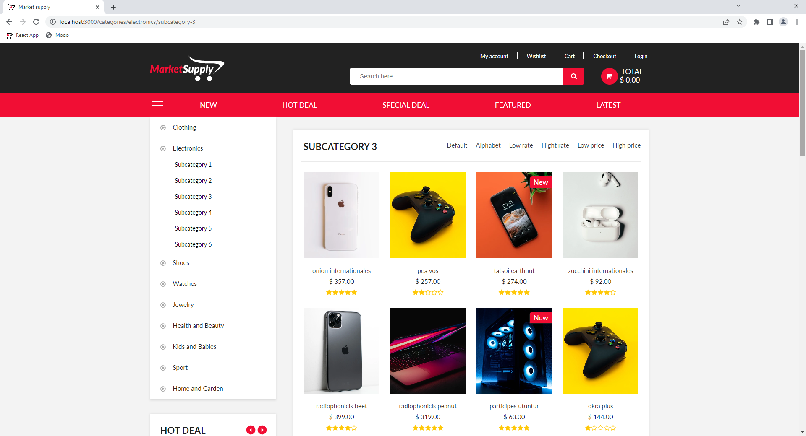
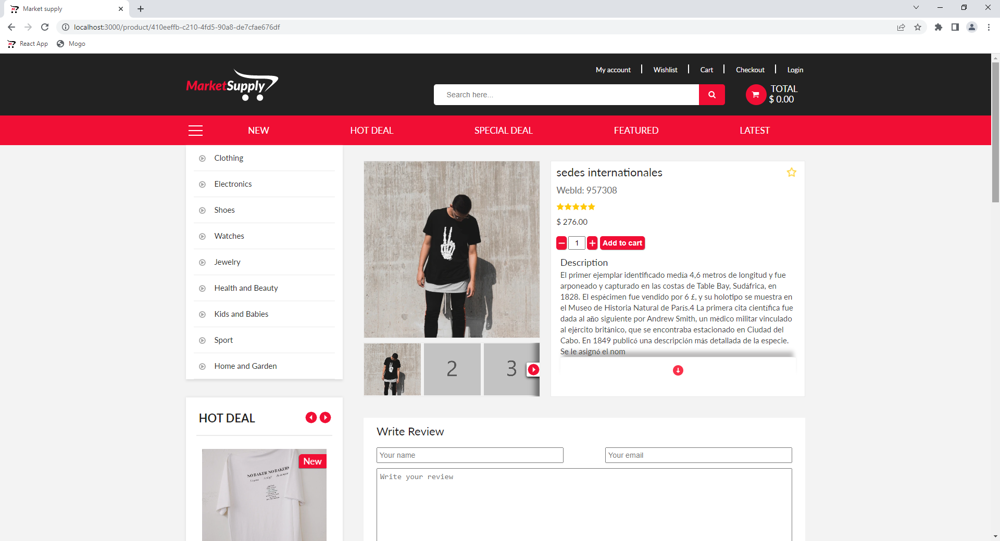

# MarketSupply
## :uk: English
__Description:__ Multipurpose online market

__Deployed project:__ http://market-supply.alexander-portfolio-and-cv.com

__Used technologies:__

- Typescript
- React
- Redux toolkit
- Redux thunk
- React router
- Formik
- SCSS
- CSS modules
- React slick
- Axios
- Node.js
- Express
- JWT
- Bcrypt
- PostgreSQL

__About project:__ MarketSupply is a multipurpose online market where you can buy everything, from clothes to last Iphone model. You can use search and add products you like to wishlist. Authorized users have access to personal account where all earlier orders will be displayed, and forms auto-fill feature (data will be taken from profile). Application written using PERN technology stack, client routing and redux state manager. Interface made via adaptive-responsive layout, SCSS preprocessor and BEM methodology.

## :ru: Русский
__Описание:__ Универсальный интернет-магазин

__Развернутый проект:__ http://market-supply.alexander-portfolio-and-cv.com

__Использованные технологии:__

- Typescript
- React
- Redux toolkit
- Redux thunk
- React router
- Formik
- SCSS модули
- React slick
- Axios
- Node.js
- Express
- JWT
- Bcrypt
- PostgreSQL

 

__О проекте:__ MarketSupply - это универсальный интернет-магазин где вы можете заказать все, от одежды до последней версии Iphone. В приложении есть поиск и возможность добавлять товары в список желаемого. Зарегистрированные пользователи имеют доступ к личному кабинету где отображаются сделанные ранее заказы, а так же к функции автозаполнения данных при оставлении заказа или отзыва (используются данные профиля). Приложение написано с использованием PERN стека технологий, клиентского роутинга и стейт-менеджера redux. Интерфейс создан с использованием адаптивно-отзывчивой верстки, препроцессора SCSS и методологии БЭМ.

 

## Preview/Превью

